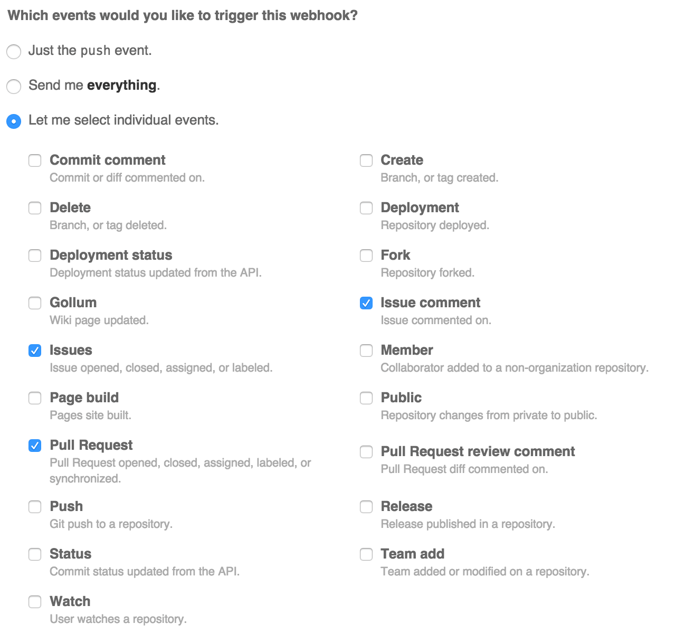

# scaling-octo-cyril

## Prerequisites
* Activator

## Usage

Set the list of people needed to approve a PR by using the following syntax inside your Pull Requests body or inside a comment:

`[approve: @charliedowler, @miketv, @violetb]`

To approve, type `+1` in a comment.

## Demo


## Setup & Installation
Until the correct authentication method is implemented, use personal access tokens to authenticate requests.
```
$ export github_user=myusername
# Your generated github personal access token
$ export github_pat=59996509090e5wgd65a1ccf48e342343297658e321
$ activator run
# server started on http://localhost:9000
```

You can change the label name and/or label color in `conf/application.conf`

`64| cyril.label = "ready"`

`65| cyril.color = "199c4b"`

### Setting up the Github webhook

1. Go to your repository settings
2. In the left hand navigation panel, click "Webhooks & Services"
3. Enter `http://{hostname}.com:9000/api/v1/pullrequest` in the `Payload URL` field

Then select the following events under `Let me select individual events`
