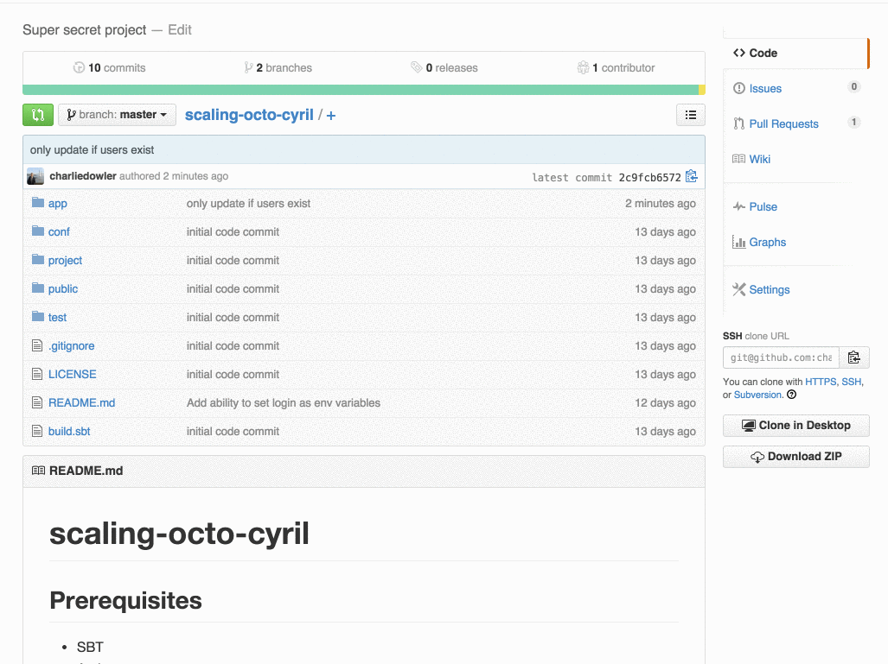

# scaling-octo-cyril

## Prerequisites
* Activator

## Usage

Set the list of people needed to approve a PR by using the following syntax inside your Pull Requests body or inside a comment:

`[approve: @charliedowler, @miketv, @violetb]`

To approve, type `+1` in a comment.

## Demo



## Setup
Until the correct authentication method is implemented, use personal access tokens to authenticate requests.
```
$ export github_user=myusername
# Your generated github personal access token
$ export github_pat=59996509090e5wgd65a1ccf48e342343297658e321
$ activator run
# server started on http://localhost:9000
```